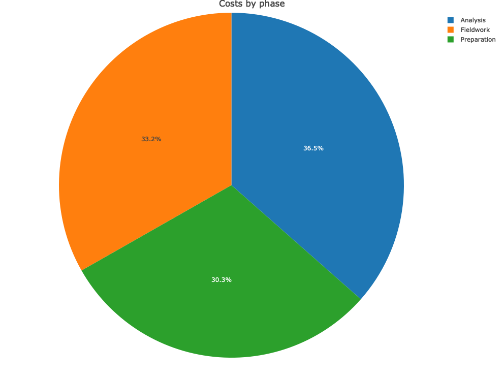
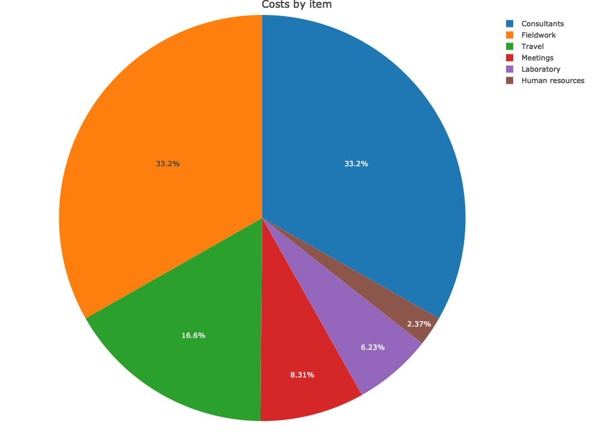

---
title:
header-includes: 
   \usepackage{graphicx}
   \usepackage{fancyhdr}
   \pagestyle{fancy}
   \setlength\headheight{28pt}
   \fancyhead[R]{\includegraphics[width=7cm]{logo3.png}}
    \fancyhead[L]{\textbf{Post-Market Surveillance Costing Tool}}
   \fancyfoot[LE,RO]{}
   \usepackage{helvet}
  \renewcommand{\familydefault}{\sfdefault}
output:
  pdf_document:
    keep_tex: yes
sansfont: Calibri
---

# Output Report

This Report provides an overview of the online PMS Costing Tool results. This information is meant to support planning and budgeting decisions associated with the implementation of Post-market surveillance activities (PMS). Calculations and assumptions are based on the PMS activities devoloped by the Systematic Tracking of At Risk Medicines ([STARmeds](https://starmeds.id/)) project:

- STARmeds collected and tested more than 1300 medicine samples between March and June 2022, from four provinces of Indonesia, using mystery shopping and online sampling techniques. 

This PMS Costing Tool is an activity-based costing model, conducted using a bottom-up approach, adopting the perspective of a healthcare regulator (no research costs included). This model uses the information filled in by toolkit users in the input tables and estimates total and relative costs of conducting PMS activities in the field. Costs are aggregated by type - i.e. expenses with salaries were aggregated by multiplying salaries by FTEs, equipment was aggregated by quantity and price, etc - and then allocated to the different phases and items. 

## - Output Tables

The tables below show costs by project phase and items according to the information filled in the toolkit, providing instant cost analysis of costs in absolute and relative terms. Costs are presented in USD, 2022 values. **Table 1** below shows costs aggregated by project phase and item, **Table 2** shows costs only by phase and **Table 3** shows costs only by item. Input tables, i.e. the tables filled in by users, are also presented in appendix.

## Table 1 - Costs by phase and type of item
```{r, echo=FALSE, results='asis'}
knitr::kable(res.cost.detail$data)
```

## Table 2 - Costs by phase
```{r, echo=FALSE, results='asis'}
knitr::kable(res.cost.phase$data)
```

## Table 3 - Costs by type of item
```{r, echo=FALSE, results='asis'}
knitr::kable(res.cost.item$data)
```  


**Figures 1 and 2** show a graphic visualization how costs are divided in relative terms to the total costs.

## Figure 1 
```{r, echo=FALSE, results='asis', out.width = "300px"}

```

## Figure 2
```{r, echo=FALSE, results='asis', out.width = "300px"}

```


\pagebreak

## Study Preparation

### Table A1 - Human Resources


```{r, echo=FALSE, results='asis'}
knitr::kable(prep.hr$data)
```  

### Table A2 - Other Costs

```{r, echo=FALSE, results='asis'}
knitr::kable(prep.other$data)
```  

## Fieldwork

### Table A3 - Sampling frame

```{r, echo=FALSE, results='asis'}
knitr::kable(fw.samplingframe$data)
```  

### Table A4 - Sampling costs

```{r, echo=FALSE, results='asis'}
knitr::kable(fw.samplecost$data)
```  

## Analysis and reporting

### Table A5 - Human Resources

```{r, echo=FALSE, results='asis'}
knitr::kable(analysis.hr$data)
```  

### Table A6 - Lab Costs

```{r, echo=FALSE, results='asis'}
knitr::kable(analysis.lab$data)
```  

### Table A7 - Other Costs

```{r, echo=FALSE, results='asis'}
knitr::kable(analysis.other$data)
```  
